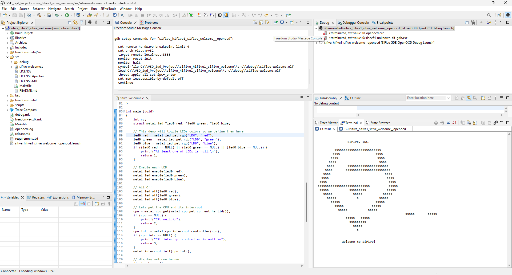
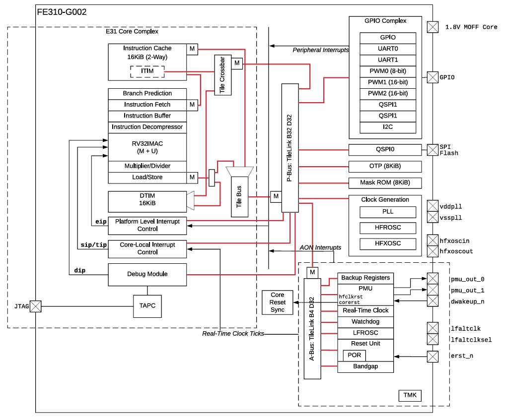
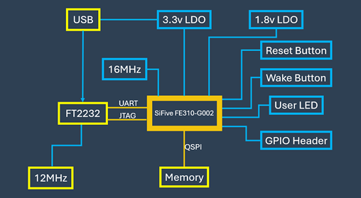
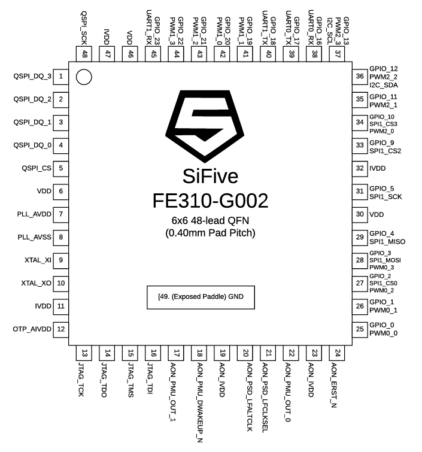
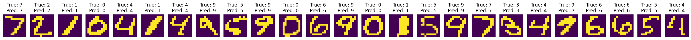

# OBJECTIVE:
>> Demonstrate the end-to-end process of taking a pre-trained and quantized neural network model, converting it for bare-metal embedded deployment, and running inference directly on a resource-constrained RISC-V microcontroller.

# SECTION 1: 

# VSDSquadron PRO Board (SiFive FE310-G002) Documentation 

This document outlines the hardware setup, software installation, basic program validation, and key specifications for the VSDSquadron PRO Board.

-----

## I. Hardware Setup & Software Installation

### RISC-V Toolchain and Required Software

Install the necessary drivers and development environment for the VSDSquadron PRO board.

#### Zadig Driver Installation

1.  **Download Zadig:** Obtain the `zadig.exe` utility.
2.  **Connect Board:** Plug the VSDSquadron PRO board into the PC.
3.  **Launch Zadig:** Run `zadig.exe`.
4.  **Select Device:** Go to `Options > List All Devices` and select `Dual RS-232-HS (Interface 0)`.
5.  **Install Driver:** Choose `libusb-win32 (v1.4.0.0)` from the driver list and click `Replace Driver`. Confirm the installation.

#### Freedom Studio Setup

1.  **Download Freedom Studio:** Download the `VSDSquadronPRO.tar` file for VSDSquadron PRO.
2.  **Extract:** Extract the contents of the `tar.gz` file to a preferred location.
3.  **Launch Freedom Studio:**
      * **Windows:** Navigate to the extracted `FreedomStudio` folder and run `FreedomStudio.exe`.
-----

## II. Basic Program Upload & Validation

### Verified Output


#### VIDEO:


## Testing 'sifive-welcome' Program:

This section details the procedure for uploading and validating the `sifive-welcome` example program.

1.  **Open Freedom Studio:** Launch the Freedom Studio IDE.
2.  **Validation Software Project:** `SiFiveTools > Create a Software Example Project > Create a new Validation Software Project > Select SDK + Give target name > Select Example Program: "sifive-welcome" > check: 1. Build the project 2. Create a debug launch configuration for [select "OPENOCD" in the dropdown menu] > Finish`
4.  **Connect Board:** Ensure the VSDSquadron PRO board is connected to the PC via USB.
5.  **Program Board:**
        In the Debug Configuration window:
      * Select `Debug Confgurations > OpenOCD > Debug > Run > ”You have an active OpenOCD debug launch. Would you like to terminate that one and continue this one?” - Yes`.
7.  **Program Execution:** The program will upload and execute.
8.  **Verify Output:**
      * Observe the `VSD Squadron PRO` serial port output in a terminal (Freedom Studio's internal console).
-----

## III. Board Specifications

The VSDSquadron PRO board is powered by the SiFive FE310-G002 RISC-V SoC.

### FE310-G002 SiFive RISC-V SoC



  * **Core:** SiFive E31 (RV32IMAC)
      * **Architecture:** 32-bit RISC-V
      * **Frequency:** Up to 320 MHz
      * **Cache:** 16KB L1 Instruction Cache
      * **Pipelining:** 4-stage pipeline
      * **Multiplier/Divider:** Single-cycle hardware multiplier, hardware divider
  * **Debug:** JTAG Debug Interface (2-bit opcode, 7-bit debug module address, 32-bit data field)


### Memory & Storage

  * **Data SRAM:** 16KB
  * **Flash Memory:** 128Mbit (16MB) QSPI Flash

### Peripherals & I/O


  * **USB:** USB to Serial converter (CP2102N)
  * **Clock:** On-board 16 MHz Crystal Oscillator
  * **LEDs:**
      * 3 User LEDs
      * 1 Debug LED
      * 1 Power LED
  * **Buttons:**
      * 1 Reset Button
      * 1 IO Button
  * **IO & Protocols:**
      * 48-lead 6x6 QFN package
      * 19 Digital IO pins and 9 PWM pins
      * 2 UART and 1 I2C
      * Dedicated quad-SPI (QSPI) flash interface
      * 32 Mbit Off-Chip (ISSI SPI Flash)
      * USB-C type for Program, JTAG Debug, and Serial Communication
  * **Form Factor**
      * L x B: 84.00 x 52.00 mm
      * Height: 8mm(Top) + 1mm(Bottom)
  * **Power:**
      * I/O: 3.3V
      * Input: 5V
        

-----

## Documentation

  * [VSDSquadron PRO Datasheet](datasheet.pdf)
  * [SiFive FE310-G002 Datasheet v1p2](fe310-g002-datasheet-v1p2.pdf)
  * [SiFive FE310-G002 Manual v1p5](manual_fe310-g002-v1p5.pdf)

# SECTION 2:

# BitNet-like Quantized MNIST Classification on VSDSquadron PRO (SiFive FE310-G002)

This section of repository contains the embedded C application and associated Python tooling for deploying a quantized MNIST handwritten digit classification model onto the VSDSquadron PRO development board, powered by the SiFive FE310-G002 RISC-V microcontroller. The solution implements a custom, highly efficient, integer-only inference engine inspired by BitNet principles.

## Aim

The primary objective of this project is to demonstrate the end-to-end process of taking a pre-trained and quantized neural network model from a high-level framework (TensorFlow/Keras), converting it for embedded deployment, and running inference directly on a bare-metal RISC-V microcontroller. This includes handling data preparation, model parameter extraction, and optimizing the inference kernel for resource-constrained environments.

## Features

* **Quantized Inference:** Efficient execution of an 8-bit quantized MNIST classification model.
* **RISC-V Compatibility:** Optimized C code for the RV32IMAC instruction set of the SiFive FE310-G002.
* **BitNet-like Operations:** Custom `processfclayer` and `ReLUNorm` functions for efficient integer-only matrix multiplication and activation with support for packed bit-weights (specifically 4-bit and 8-bit handling demonstrated).
* **Automated Parameter Generation:** Python script to extract quantized weights, biases, and other layer parameters directly from a TensorFlow Lite (`.tflite`) model into C-compatible arrays.
* **Bare-Metal Execution:** Runs directly on the microcontroller without an operating system.
* **Serial Output:** Inference results are printed to a serial terminal for verification.

## Hardware Requirements

* **VSDSquadron PRO Development Board:** Featuring the SiFive FE310-G002 RISC-V SoC.
* **USB-C Cable:** For power, programming, debugging, and serial communication.

## Software Requirements

* **Freedom Studio 3.1.1:** The integrated development environment (IDE) for SiFive RISC-V development.
    * Download and installation instructions can be found in the [VSDSquadron PRO User Guide](datasheet.pdf).
* **Python 3.x:** For running the model parameter generation script.
* **Python Libraries:**
    * `tensorflow` (version 2.15.0 used in development).
    * `numpy`.

## Project Structure

```
DIR: sifive_hifive1_BitNet_MNIST_App
.
├── src/
│   ├── app_inference.h                \# Core C inference functions (processfclayer, ReLUNorm)
│   ├── main.c                         \# Main application logic, inference orchestration
│   ├── mnist_model_data.h             \# Contains the raw mnist\_quantized\_model.tflite binary data (for reference)
│   ├── mnist_model_params.c           \# Generated C source file with actual model weights, biases, and parameters
│   ├── mnist_model_params.h           \# Generated C header with extern declarations for model parameters
│   ├── mnist_quantized_model.tflite   \# The quantized TensorFlow Lite model binary
│   └── Makefile                       \# Project-specific Makefile
├── mnist_baseline_model.ipynb         \# Jupyter notebook for model training, quantization, and .tflite export
├── bsp/                               \# Board Support Package (BSP) - provided by Freedom Studio/SiFive
├── freedom-metal/                     \# Freedom Metal library - bare-metal abstraction layer
├── scripts/                           \# Utility scripts for SDK (e.g., openocdcfg-generator)
└── ... (other SDK-related files and directories)

```

## Getting Started

Follow these steps to set up the development environment, generate model parameters, build the application, and run inference on your VSDSquadron PRO board.

### 1. Install Freedom Studio

Refer to the official [VSDSquadron PRO User Guide](datasheet.pdf) for detailed instructions on downloading, installing, and setting up Freedom Studio 3.1.1, including driver installation (e.g., using Zadig).

### 2. Prepare Python Environment

Ensure you have Python 3.x installed and the necessary libraries.

```bash
pip install tensorflow numpy
```

### 3\. Generate C Model Parameters and Sample Inputs

The `mnist_baseline_model.ipynb` notebook trains and quantizes the MNIST model, saving it as `mnist_quantized_model.tflite`. The `generate_c_model_params.py` script then extracts the layer-specific data from this `.tflite` file into C arrays.

1.  **Run Jupyter Notebook:** Open and run all cells in `mnist_baseline_model.ipynb` to ensure `mnist_quantized_model.tflite` is generated.

2.  **Run Parameter Generation Script:** Navigate to the `src/` directory in your terminal (e.g., `C:\VSD_Sqd_Project\sifive_hifive1_BitNet_MNIST_App\src\`) and execute:

    ```bash
    jupyter nbconvert --to notebook --execute mnist_baseline_model.ipynb --output-dir output --ExecutePreprocessor.timeout=600 (timeout is optional, but should generally be enough)
    ```

    This will create (or update) `mnist_model_params.h` and `mnist_model_params.c` in the `src/` directory. These files contain the quantized weights, biases, scales, zero points, and also the quantized sample input images and their labels.

### 4\. Build the Embedded Application

1.  **Open Project in Freedom Studio:** Launch Freedom Studio and import the `sifive_hifive1_BitNet_MNIST_App` project.

2.  **Clean Project:** In Freedom Studio, go to `Project -> Clean...`, select your project, and click `Clean`.

3.  **Build Project:** In Freedom Studio, go to `Project -> Build Project` or click the hammer icon in the toolbar.

      * **Expected Output:** The build should complete with `0 errors` and possibly `1 warning` (related to `RWX permissions` which is common in development). This indicates successful compilation and linking of all C source files, including the generated `mnist_model_params.c`.

### 5\. Configure and Run on VSDSquadron PRO

1.  **Connect Board:** Connect your VSDSquadron PRO board to your computer via a USB-C cable.

2.  **Configure Debug Launch:**

      * In Freedom Studio, go to `Run -> Debug Configurations...`.
      * In the left pane, expand `GDB OpenOCD Debugging` and select your project's launch configuration (e.g., `sifive_hifive1_BitNet_MNIST_App Debug`).
      * In the "Main" tab, ensure the "C/C++ Application" field points to the correct executable:
        ```
        ${workspace_loc:/sifive_hifive1_BitNet_MNIST_App/src/debug/main.elf}
        ```
        If it points to `empty.elf` or another path, correct it using the "Browse..." button.
      * Click `Apply` to save the changes.

3.  **Start Debug Session:** Click the `Debug` button in the Debug Configurations dialog, or the green bug icon in the toolbar.

      * If prompted to terminate a previous debug session, confirm "Yes".
      * The debugger will connect to the board and load the `main.elf` program. It will likely pause at the `main` function.

4.  **Run Program:** Click the `Resume` (green play) button to let the program execute.

5.  **Observe Output:** Monitor the "Console" or "Serial Terminal" view in Freedom Studio. You should see output similar to:

    ```
    BitNet MNIST Dataset Handwritten Digit Classification on sifive-hifive1.


    By Shwetank ShekharStarting MNIST inference...
    Inference of Sample 1   Prediction: 7   Label: 7
    Inference of Sample 2   Prediction: 2   Label: 2
    Inference of Sample 3   Prediction: 0   Label: 1
    Inference of Sample 4   Prediction: 0   Label: 0
    ```

    This confirms that the model is running on the hardware and performing inferences.

## Model Details

The model used is a simple feed-forward neural network for MNIST handwritten digit classification, trained using Keras and then quantized to 8-bit integers using TensorFlow Lite.

  * **Input Layer:** Flatten (28x28 grayscale image) -> 784 features.
  * **Hidden Layer:** Dense layer with 8 neurons, ReLU activation.
  * **Output Layer:** Dense layer with 10 neurons (for 10 digits), Softmax activation.

The C inference engine (`app_inference.h`) is specifically tailored to handle 4-bit symmetric and 8-bit two's complement quantized weights, common in highly optimized embedded neural networks.

## Troubleshooting / Common Issues

For detailed explanations of specific errors encountered during development and their resolutions, please refer to the comprehensive [Error Resolution Log](sifive_hifive1_BitNet_MNIST_App/Error_Resolution.md).

Common issues addressed include:

  * Incorrect compiler attributes for functions.
  * Missing or undeclared model parameters in C code.
  * Python script errors due to TensorFlow Lite API changes (e.g., `AttributeError`, `KeyError`, `ModuleNotFoundError`).
  * Runtime hangs on the embedded target due to incorrect quantized arithmetic (e.g., 4-bit sign extension, `ReLUNorm` scaling issues).
  * Incorrect debug launch configurations in Freedom Studio.

## Status: Ongoing

Current Stage Output:
```
BitNet MNIST Dataset Handwritten Digit Classification on sifive-hifive1.


By Shwetank Shekhar
Starting MNIST inference...
Processing input for sample 1
Debug: Starting first layer processing
Debug: First layer complete, applying ReLU
Debug: Starting second layer
Debug: Second layer complete, applying ReLU
Debug: Starting third layer
Debug: Third layer complete, scaling outputs
Predicted digit: 7, True Label: 7, Status: PASS

Processing input for sample 2
Debug: Starting first layer processing
Debug: First layer complete, applying ReLU
Debug: Starting second layer
Debug: Second layer complete, applying ReLU
Debug: Starting third layer
Debug: Third layer complete, scaling outputs
Predicted digit: 1, True Label: 2, Status: FAIL

Processing input for sample 3
Debug: Starting first layer processing
Debug: First layer complete, applying ReLU
Debug: Starting second layer
Debug: Second layer complete, applying ReLU
Debug: Starting third layer
Debug: Third layer complete, scaling outputs
Predicted digit: 1, True Label: 1, Status: PASS

Processing input for sample 4
Debug: Starting first layer processing
Debug: First layer complete, applying ReLU
Debug: Starting second layer
Debug: Second layer complete, applying ReLU
Debug: Starting third layer
Debug: Third layer complete, scaling outputs
Predicted digit: 0, True Label: 0, Status: PASS

Processing input for sample 5
Debug: Starting first layer processing
Debug: First layer complete, applying ReLU
Debug: Starting second layer
Debug: Second layer complete, applying ReLU
Debug: Starting third layer
Debug: Third layer complete, scaling outputs
Predicted digit: 4, True Label: 4, Status: PASS

Processing input for sample 6
Debug: Starting first layer processing
Debug: First layer complete, applying ReLU
Debug: Starting second layer
Debug: Second layer complete, applying ReLU
Debug: Starting third layer
Debug: Third layer complete, scaling outputs
Predicted digit: 1, True Label: 1, Status: PASS

Processing input for sample 7
Debug: Starting first layer processing
Debug: First layer complete, applying ReLU
Debug: Starting second layer
Debug: Second layer complete, applying ReLU
Debug: Starting third layer
Debug: Third layer complete, scaling outputs
Predicted digit: 4, True Label: 4, Status: PASS

Processing input for sample 8
Debug: Starting first layer processing
Debug: First layer complete, applying ReLU
Debug: Starting second layer
Debug: Second layer complete, applying ReLU
Debug: Starting third layer
Debug: Third layer complete, scaling outputs
Predicted digit: 1, True Label: 9, Status: FAIL

Processing input for sample 9
Debug: Starting first layer processing
Debug: First layer complete, applying ReLU
Debug: Starting second layer
Debug: Second layer complete, applying ReLU
Debug: Starting third layer
Debug: Third layer complete, scaling outputs
Predicted digit: 6, True Label: 5, Status: FAIL

Processing input for sample 10
Debug: Starting first layer processing
Debug: First layer complete, applying ReLU
Debug: Starting second layer
Debug: Second layer complete, applying ReLU
Debug: Starting third layer
Debug: Third layer complete, scaling outputs
Predicted digit: 4, True Label: 9, Status: FAIL
```

See [TASK_3_sifive_hifive1_BitNet_MNIST_App_OPTIMIZED/README.md](TASK_3_sifive_hifive1_BitNet_MNIST_App_OPTIMIZED/README.md) for more details

# SECTION 3:

Tried a bunch of combination(s) of `IMAGE PREPROCESSING TECHNIQUES` - cropped the image to the Region of Interest and converted to Binary and `MODEL ARCHITECTURE` - Varying Learning Rate, Bias, Activation Functions, etc. and managed to design and deploy a highly optimized, efficient and reliable model.

## Model Summary:
```
Model: "sequential_12"
_________________________________________________________________
 Layer (type)                Output Shape              Param #   
=================================================================
 flatten_12 (Flatten)        (None, 144)               0         
                                                                 
 dense_36 (Dense)            (None, 64)                9280      
                                                                 
 leaky_re_lu_6 (LeakyReLU)   (None, 64)                0         
                                                                 
 dense_37 (Dense)            (None, 64)                4160      
                                                                 
 leaky_re_lu_7 (LeakyReLU)   (None, 64)                0         
                                                                 
 dense_38 (Dense)            (None, 10)                650       
                                                                 
=================================================================
Total params: 14090 (55.04 KB)
Trainable params: 14090 (55.04 KB)
Non-trainable params: 0 (0.00 Byte)

INT8 TFLite model saved to mnist_model_int8.tflite
INT8 Model Size: 17768 bytes (17.35 KB)
Cleaned up temporary Keras model file: mnist_baseline_model.keras

Model Details:
Input: [{'name': 'serving_default_flatten_12_input:0', 'index': 0, 'shape': array([ 1, 12, 12,  1]), 'shape_signature': array([-1, 12, 12,  1]), 'dtype': <class 'numpy.int8'>, 'quantization': (0.003921568859368563, -128), 'quantization_parameters': {'scales': array([0.00392157], dtype=float32), 'zero_points': array([-128]), 'quantized_dimension': 0}, 'sparsity_parameters': {}}]
Output: [{'name': 'StatefulPartitionedCall:0', 'index': 14, 'shape': array([ 1, 10]), 'shape_signature': array([-1, 10]), 'dtype': <class 'numpy.int8'>, 'quantization': (0.00390625, -128), 'quantization_parameters': {'scales': array([0.00390625], dtype=float32), 'zero_points': array([-128]), 'quantized_dimension': 0}, 'sparsity_parameters': {}}]
```
For details please refer to the comprehensive attachments:

1. [/src](sifive_hifive1_BitNet_MNIST_App_12x12/src)
2. [Image Processing](sifive_hifive1_BitNet_MNIST_App_12x12/src/Image_Processing.ipynb)
3. [Error Resolution Log](sifive_hifive1_BitNet_MNIST_App_12x12/ERROR_LOG.md).
4. References:

   i. [Optimizing_Edge_AI_A_Comprehensive_Survey.pdf](Optimizing_Edge_AI_A_Comprehensive_Survey.pdf)
   
   ii. https://docs.edgeimpulse.com/docs/concepts/machine-learning/neural-networks/loss-functions
   
   iii.https://medium.com/@sushmita2310/12-types-of-activation-functions-in-neural-networks-a-comprehensive-guide-a441ecefb439


### OUTPUT:
```
8-bit Quantized TFLite MNIST on SiFive HiFive1.


By Shwetank Shekhar
Starting MNIST inference...
Clearing arrays...
Processing input for sample 1
Starting first layer...
Processing layer: in=144, out=64
Applying ReLU and Requantizing first layer...
Layer1 ReLU range: -96 to 127
Layer1 sample activations: 127 127 127 127
Starting second layer...
Processing layer: in=64, out=64
Applying ReLU and Requantizing second layer...
Layer2 ReLU range: -103 to 127
Layer2 sample activations: -103 -103 127 127
Starting final layer...
Processing layer: in=64, out=10
Output layer values: -61807 -25412 -16241 -6761 -82783 -24893 -197008 25675 -55464 -84508 
Finding prediction...
Predicted digit: 7, True Label: 7, Status: PASS

Clearing arrays...
Processing input for sample 2
Starting first layer...
Processing layer: in=144, out=64
Applying ReLU and Requantizing first layer...
Layer1 ReLU range: -96 to 127
Layer1 sample activations: -96 -96 127 -96
Starting second layer...
Processing layer: in=64, out=64
Applying ReLU and Requantizing second layer...
Layer2 ReLU range: -103 to 127
Layer2 sample activations: -103 -103 127 -103
Starting final layer...
Processing layer: in=64, out=10
Output layer values: -90097 -7702 33439 -31831 -96813 -24433 -170098 -38725 -17284 -116708 
Finding prediction...
Predicted digit: 2, True Label: 2, Status: PASS

Clearing arrays...
Processing input for sample 3
Starting first layer...
Processing layer: in=144, out=64
Applying ReLU and Requantizing first layer...
Layer1 ReLU range: -96 to 127
Layer1 sample activations: 127 127 127 127
Starting second layer...
Processing layer: in=64, out=64
Applying ReLU and Requantizing second layer...
Layer2 ReLU range: -103 to 127
Layer2 sample activations: -103 -103 -103 127
Starting final layer...
Processing layer: in=64, out=10
Output layer values: -88717 13688 -1291 -50001 -17923 -63073 -84308 25675 -58684 -116018 
Finding prediction...
Predicted digit: 7, True Label: 1, Status: FAIL

Clearing arrays...
Processing input for sample 4
Starting first layer...
Processing layer: in=144, out=64
Applying ReLU and Requantizing first layer...
Layer1 ReLU range: -96 to 127
Layer1 sample activations: 127 127 -96 -96
Starting second layer...
Processing layer: in=64, out=64
Applying ReLU and Requantizing second layer...
Layer2 ReLU range: -103 to 127
Layer2 sample activations: 127 -103 127 -103
Starting final layer...
Processing layer: in=64, out=10
Output layer values: -21834 -73887 -41751 -90044 -43817 -15372 -67014 5118 -61485 -94200 
Finding prediction...
Predicted digit: 0, True Label: 0, Status: PASS

Clearing arrays...
Processing input for sample 5
Starting first layer...
Processing layer: in=144, out=64
Applying ReLU and Requantizing first layer...
Layer1 ReLU range: -96 to 127
Layer1 sample activations: -96 127 127 127
Starting second layer...
Processing layer: in=64, out=64
Applying ReLU and Requantizing second layer...
Layer2 ReLU range: -103 to 127
Layer2 sample activations: -103 127 127 -103
Starting final layer...
Processing layer: in=64, out=10
Output layer values: -25467 -8162 -53271 -105661 -36093 -103553 -70738 -25615 -16824 -19648 
Finding prediction...
Predicted digit: 4, True Label: 4, Status: PASS

Clearing arrays...
Processing input for sample 6
Starting first layer...
Processing layer: in=144, out=64
Applying ReLU and Requantizing first layer...
Layer1 ReLU range: -96 to 127
Layer1 sample activations: 127 127 127 127
Starting second layer...
Processing layer: in=64, out=64
Applying ReLU and Requantizing second layer...
Layer2 ReLU range: -103 to 127
Layer2 sample activations: 127 -103 127 127
Starting final layer...
Processing layer: in=64, out=10
Output layer values: -74917 21278 -47751 -74151 -57023 -46973 -61078 -11585 -66044 -63808 
Finding prediction...
Predicted digit: 1, True Label: 1, Status: PASS

Clearing arrays...
Processing input for sample 7
Starting first layer...
Processing layer: in=144, out=64
Applying ReLU and Requantizing first layer...
Layer1 ReLU range: -96 to 127
Layer1 sample activations: 127 127 127 127
Starting second layer...
Processing layer: in=64, out=64
Applying ReLU and Requantizing second layer...
Layer2 ReLU range: -103 to 127
Layer2 sample activations: -103 -103 127 127
Starting final layer...
Processing layer: in=64, out=10
Output layer values: -75837 -28402 -81331 -52531 -42533 -25583 -87988 -19175 -36144 -85658 
Finding prediction...
Predicted digit: 4, True Label: 4, Status: PASS

Clearing arrays...
Processing input for sample 8
Starting first layer...
Processing layer: in=144, out=64
Applying ReLU and Requantizing first layer...
Layer1 ReLU range: -96 to 127
Layer1 sample activations: -96 -96 127 127
Starting second layer...
Processing layer: in=64, out=64
Applying ReLU and Requantizing second layer...
Layer2 ReLU range: -103 to 127
Layer2 sample activations: -103 -103 127 127
Starting final layer...
Processing layer: in=64, out=10
Output layer values: -125747 -75092 -60861 -20331 -6193 -43753 -147558 -46315 6406 24972 
Finding prediction...
Predicted digit: 9, True Label: 9, Status: PASS

Clearing arrays...
Processing input for sample 9
Starting first layer...
Processing layer: in=144, out=64
Applying ReLU and Requantizing first layer...
Layer1 ReLU range: -96 to 127
Layer1 sample activations: 127 127 -96 127
Starting second layer...
Processing layer: in=64, out=64
Applying ReLU and Requantizing second layer...
Layer2 ReLU range: -103 to 127
Layer2 sample activations: 127 -103 127 -103
Starting final layer...
Processing layer: in=64, out=10
Output layer values: -98607 -4712 -55341 -94621 -7803 -2813 -55098 -6065 -51324 -89568 
Finding prediction...
Predicted digit: 5, True Label: 5, Status: PASS

Clearing arrays...
Processing input for sample 10
Starting first layer...
Processing layer: in=144, out=64
Applying ReLU and Requantizing first layer...
Layer1 ReLU range: -96 to 127
Layer1 sample activations: 127 127 127 127
Starting second layer...
Processing layer: in=64, out=64
Applying ReLU and Requantizing second layer...
Layer2 ReLU range: -103 to 127
Layer2 sample activations: -103 -103 127 127
Starting final layer...
Processing layer: in=64, out=10
Output layer values: -83887 -30012 -89381 -44941 -67373 12827 -155838 -1235 -51094 3352 
Finding prediction...
Predicted digit: 9, True Label: 9, Status: PASS

```



## License

This project is licensed under the Apache 2.0 License - see the `LICENSE` file for details.

## Acknowledgments

  * VLSI System Design (VSD) & Mawle Technologies for the VSDSquadron PRO board and the internship opportunity.
  * SiFive for the FE310-G002 RISC-V SoC and Freedom Studio.
  * TensorFlow Lite team for the quantization and inference tools.
